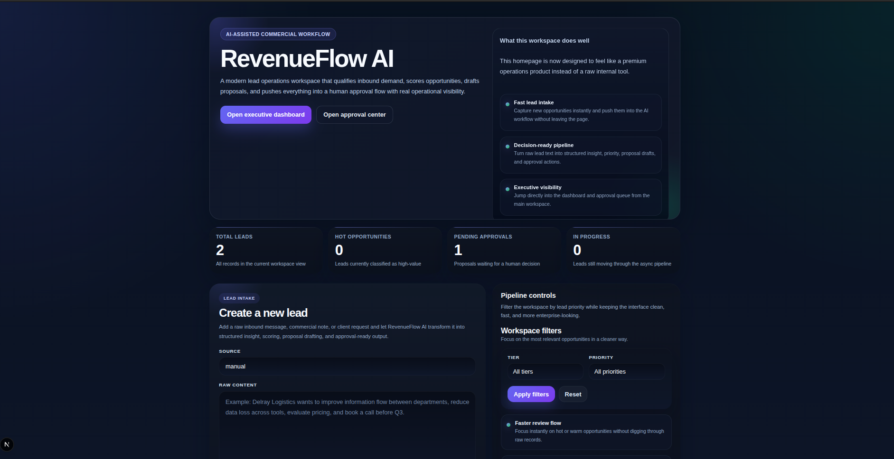
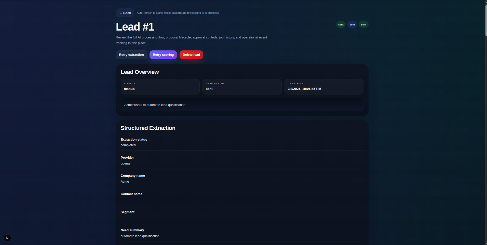
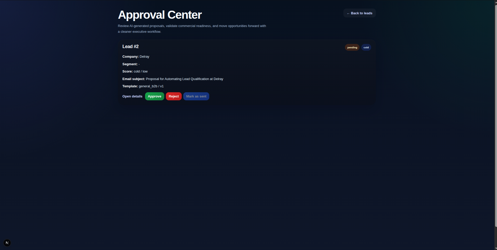
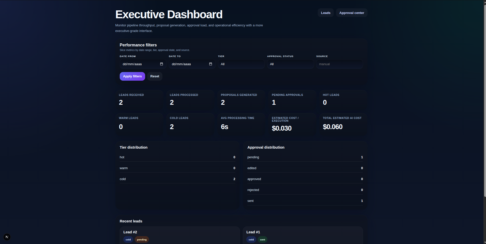
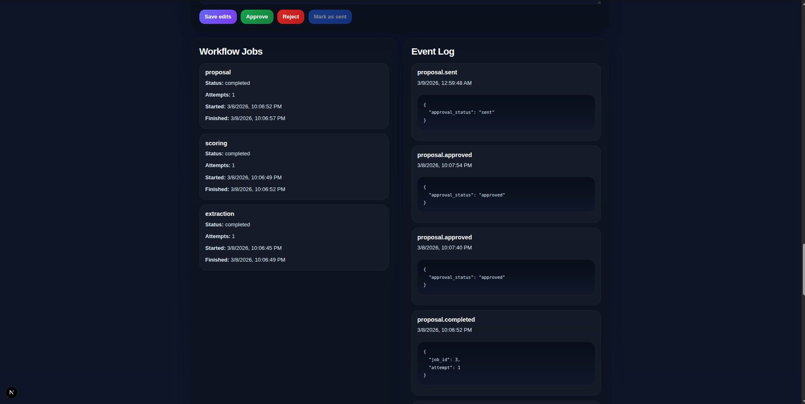
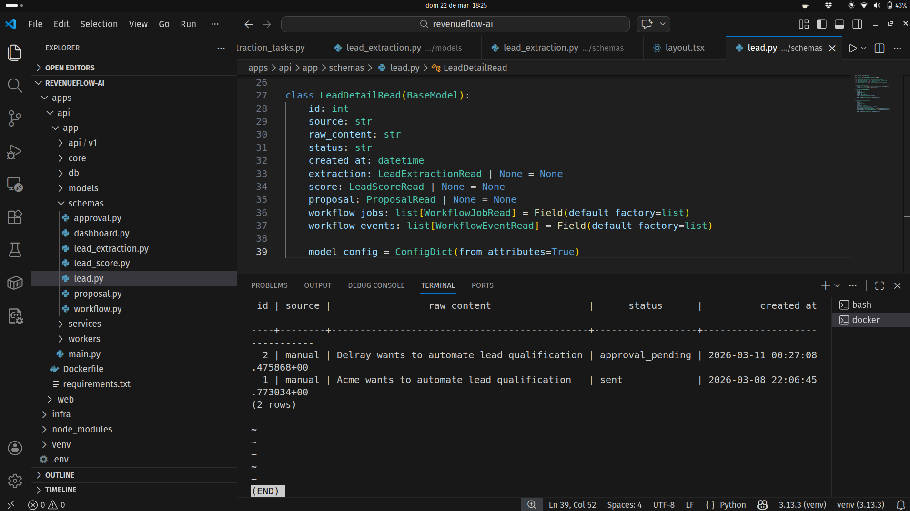

# RevenueFlow AI

**AI-powered lead operations platform for structured extraction, lead scoring, proposal drafting, and human-in-the-loop approval.**

RevenueFlow AI turns raw inbound lead text into a real commercial workflow. A lead enters the system, gets structured by AI, is prioritized by score, converted into a proposal draft, and routed through human approval before any final action is taken.

This is intentionally built as a portfolio-grade product, not a chatbot demo. It includes asynchronous processing, persistent workflow state, an executive dashboard, audit-friendly job tracking, and PostgreSQL-backed domain data. The result is a strong demonstration of AI engineering, backend architecture, and product thinking in one system.

## Why this project stands out

Most AI projects stop at generation. RevenueFlow AI is different because it focuses on workflow value.

It shows how AI can support a business process end to end: qualification, prioritization, proposal drafting, approval, and reporting. That makes the project much more credible for clients and hiring teams because the output is not just text, but a decision-ready commercial asset.

## What the platform does

- Accepts raw inbound lead text through a web interface
- Extracts structured commercial data with AI
- Scores and prioritizes leads automatically
- Generates proposal and email drafts
- Routes proposals through human approval
- Tracks jobs, errors, and workflow events
- Displays executive metrics in a dashboard
- Persists all core data in PostgreSQL

## Core workflow

1. A lead is created from a raw message or commercial note.
2. The API stores the lead and queues background work.
3. A worker extracts structured fields from the text.
4. The scoring engine classifies the lead as hot, warm, or cold.
5. The proposal engine drafts a commercial response.
6. A human reviews, edits, approves, rejects, or sends the proposal.
7. The dashboard surfaces operational metrics and recent activity.

## Main domains

- `leads`
- `lead_extractions`
- `lead_scores`
- `proposals`
- `workflow_jobs`
- `workflow_events`

## Tech stack

- **Frontend:** Next.js
- **Backend:** FastAPI
- **Async processing:** Celery
- **Queue:** Redis
- **Database:** PostgreSQL
- **AI provider:** OpenAI
- **Local deployment:** Docker Compose

## Architecture

- The web app handles lead intake, dashboarding, and approval actions.
- The API stores the domain objects and exposes the workflow endpoints.
- Celery workers process extraction, scoring, and proposal generation asynchronously.
- Redis manages the job queue.
- PostgreSQL stores the full workflow state, including jobs and events.

## Screenshots













## Why this is portfolio strong

RevenueFlow AI demonstrates:

- AI applied to a real business workflow
- structured output validation
- asynchronous processing
- operational observability
- human approval before delivery
- executive-level metrics
- product-oriented engineering
- database persistence and traceability

That combination makes the project much stronger than a standard AI demo or CRUD app.

## Local run

```bash
docker compose up --build
```

Open:

- Web app: `http://localhost:3000`
- API: `http://localhost:8000`

## Environment

Create a `.env` file based on the example file in the repository and set:

- OpenAI API key
- PostgreSQL connection values
- Redis connection values
- web API URL variables

## Suggested demo narrative

When presenting this project, the story is:

1. A lead comes in.
2. AI extracts the commercial meaning.
3. The system scores urgency and quality.
4. A proposal draft is generated.
5. A human reviews the output.
6. The dashboard makes performance visible.

That is the core value proposition: AI that fits into a business workflow, not just a prompt response.

## Roadmap

### V1
Portfolio-grade workflow with intake, extraction, scoring, proposal generation, approval flow, dashboard, and async execution.

### V2
Integrations, authentication, multi-user support, CRM writeback, email automation, and stronger operational controls.

### V3
Multi-tenant SaaS features, RBAC, billing hooks, advanced analytics, quality evaluation, and cloud production deployment.

## Status

This repository currently represents a strong V1 portfolio build with a product-first workflow and a realistic AI operations story.

## Contact

Built as part of an AI engineering portfolio.